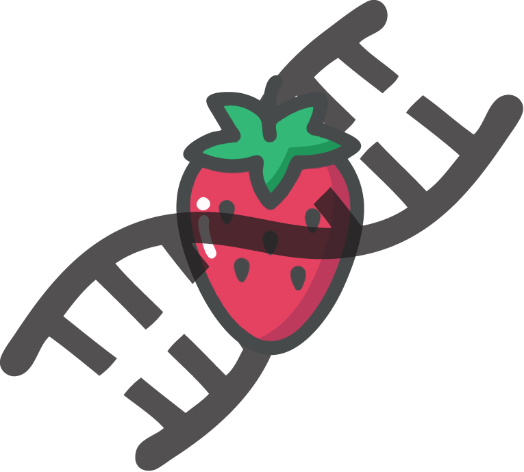

# **Homebrew DNA Extraction**

# Introduction 
DNA, or deoxyribonucleic acid carries genetic instruction in all organisms. This molecule can be extracted from the cells of organisms (Strawberry, for example) with a few household chemicals.

# Theory 
DNA is complexed with proteins and protected from the outside by the lipid membrane of the cell (and/or nucleus). To break down these barriers we can make use of common household compounds and basic chemistry.
Strawberries have a high DNA content (octoploid DNA) which makes them ideal for this application. The

# Materials 
**Chemicals**
* Isopropyl Alcohol (chilled) 
* Dishsoap
* Salt
* Water

**Other**
* 1 Strawberry
* Coffee Filter
* Several cups, preferably glass
* Plastic bag

# Warnings and Safety Data Sheets 
**WARNING:** 
The chemicals used in this protocol can be hazardous if handled improperly. Please follow the guidelines for handling and personal protective equipment dictated in the material safety data sheets.

Dishsoap: http://sds.chemtel.net/webclients/cheneybrothers/540011SDS.pdf

Isopropyl Alcohol: http://websites.retailcatalog.us/1424/mm/isopropyl-alcohol.pdf

Water: http://www.labchem.com/tools/msds/msds/LC26750.pdf

Table Salt: https://www.neb.com/-/media/89d052d2de5f4cf78389caf4c9a1f03c.pdf

# Steps 
## 1. Homogenization of Strawberry Tissue
* Slice the off the stem of the strawberry and place it into the plastic bag and seal.
* With you hands mash the strawberry into a uniform pulp.

## 2. Making Extraction Solution
* In a cup measure out equal parts water 

