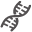

# **Homebrew DNA Extraction**

# Introduction 
DNA, or deoxyribonucleic acid carries genetic instruction in all organisms. This molecule can be extracted from the cells of organisms (Strawberry, for example) with a few household chemicals.

# Theory 
DNA is complexed with proteins and protected from the outside by the lipid membrane of the cell (and/or nucleus). To break down these barriers we can make use of common household compounds and basic chemistry.
Strawberries have a high DNA content (octoploid DNA) which makes them ideal for this application. The

# Materials 
**Chemicals**
* Isopropyl Alcohol (chilled) 
* Dishsoap
* Salt
* Water

**Other**
* 1 Strawberry
* Coffee Filter
* Cups (preferably glass0
* Liquid measuring equipment
* A container with a volume >250 mL
* Resealable plastic bag
* Digital kitchen scale
* Rubberband

# Warnings and Safety Data Sheets 
**WARNING:** 
The chemicals used in this protocol can be hazardous if handled improperly. Please follow the guidelines for handling and personal protective equipment dictated in the material safety data sheets.

Dishsoap: http://sds.chemtel.net/webclients/cheneybrothers/540011SDS.pdf

Isopropyl Alcohol: http://websites.retailcatalog.us/1424/mm/isopropyl-alcohol.pdf

Water: http://www.labchem.com/tools/msds/msds/LC26750.pdf

Table Salt: https://www.neb.com/-/media/89d052d2de5f4cf78389caf4c9a1f03c.pdf

# Steps 
## 1. Homogenization of Strawberry Tissue
* Slice the off the stem of the strawberry and place it into the plastic bag and seal.
* With you hands mash the strawberry into a uniform pulp.

## 2. Making Extraction Solution
* In the 250 mL or greater container add the following
-12.5 mL of dishsoap (~3/4 tablespoons)
-15 g of salt (~1/2 tablespoons)
-Water to 250 mL (~1 cups)
* Mix until salt has dissolved

## 3. Breakdown Cell Components with Extraction Solution
* To the plastic bag containing the mashed strawberry add 10 mL (~3/4 tablespoon) of extraction buffer.
* Continue homogenizing for 2 to 3 more minutes.

## 4. Collecting DNA Solution
* Place the coffee filter over the mouth of a cup and secure with a rubber band (see image below).

* Pour strawberry mash into the filter and allow the liquid to strain through the filter. This liquid contains the DNA.
* Dispose of the filter and strawberry mash.

## 4. Precipitating the DNA with Alcohol
* Slowly add 20 mL (~1.5 tablespoons) of ice-cold isopropyl alcohol to the DNA solution.
* Continue homogenizing for 2 to 3 more minutes.
* Allow to sit for a minute, a white precipitate should form at the interface of the two liquids. This is the DNA.

## 4. Collect the DNA

